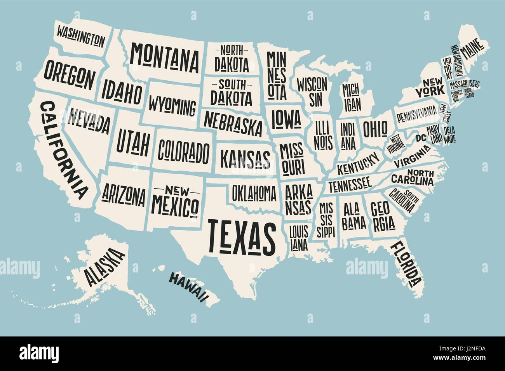

```{r setup, include=FALSE}
library(tidyverse)
library(ggplot2)
library(data.table)
library(maps)
library(plotly)
library(viridis)
library(gganimate)
```

```{r,include=FALSE}
#Import and clean data 
brfss = read_csv("data/BRFSS__Table_of_Tobacco_Use.csv") %>% 
  janitor::clean_names() %>% 
  filter(year == "2016"|year ==  "2017"|year ==  "2018"|year ==  "2019"|year ==  "2020") %>% 
  select(year, locationabbr, locationdesc, break_out, break_out_category,topic, question, geo_location, sample_size, data_value, response, question ) %>% 
  drop_na()
```

### Which states has the highest and lowest smoking proportion? 

```{r,include=FALSE}
#A plot showing the geographic locations of smokers

clean_brfss = brfss %>% 
  select(-break_out, -break_out_category, -data_value) %>% 
  #later: smoker status may be useful too....
  filter(topic == "Current Smoker Status") %>% 
  filter(year != 2016) %>%
  select(-topic, -question) %>% 
  mutate(response = as.factor(response), 
         response = recode(response, "Yes" = "smoker", "No" = "non-smoker"))%>% 
  group_by(year, locationdesc) %>%
  mutate(pop_sum=sum(sample_size))  %>%
  ungroup() %>% 
  group_by(year, locationdesc, response) %>%
  mutate(smoking_statue_sum =sum(sample_size)) %>%
  select(-sample_size) %>% 
  distinct() %>% 
  pivot_wider(
    names_from = response,
    values_from = smoking_statue_sum) %>% 
  mutate(smoking_proportion = smoker/pop_sum) %>% 
  #I have to make the long, lat and remove the backets!
  mutate(geo_location = str_replace_all(geo_location, "\\*|\\(|\\)", "")) %>% 
  #create long and lat 
  separate(geo_location, c('lat', 'long'), sep = ",")%>% 
  mutate (long = as.numeric(long), 
          lat = as.numeric(lat))
  
#I learnt aggregate function in this homework ! #aggregate(.~fruit,data=df,FUN=sum)
#or you can use group_by(id1, id2) %>%  summarise_each(funs(mean) if you want to sum of rows based on column value in R dataframe
  
  #e.g  group_by(year, locationdesc) %>% summarise(Frequency = sum(sample_size))
# tm_facets(by = "year", nrow = 2, free.coords = FALSE)
```

#### The highest smoking proportion

```{r, message = FALSE}
three_highest =
  clean_brfss %>%
  select(year, locationdesc, smoking_proportion) %>%
  group_by(year) %>%
  top_n(3) %>%
  arrange(year, desc(smoking_proportion))

knitr::kable(three_highest)
```

**West Virginia**, **Kentucky**, and **Tennessee** have a comparatively high smoking proportion. In year 2017, 2018, and 2020, West Virginia has the highest smoking proportion in the U.S, which were 22%, 21% and 20.2% respectively. For 2019, it has the second highest smoking proportion (20.1%), which was slightly lower than that of Kentucky by approximately 0.5%.

In 2019, the state with the highest smoker proportion was Kentucky, which was 20.6 %. Its smokers' proportion also account for a high percentage in other years, which were 21.1 % in 2017, 19.9% in 2018, 19.4% in 2020.

Tennessee has a relatively low smokers' proportion compared to the other two states. The proportions were 21.1%, 19.9%,20.6%, 19.3% in year 2017,2018,2019 and 2020 respectively.

#### The lowest smoking proportion

```{r}
three_lowest =
  clean_brfss %>%
  select(year, locationdesc, smoking_proportion) %>%
  mutate(year = as.factor(year)) %>%
  group_by(year) %>%
  top_n(-3) %>%
  arrange(year, smoking_proportion)

knitr::kable(three_lowest)  
```

Among all the states, **Utah** has the lowest smoking proportion in year 2017-2020. The smoking proportions were 8.2% in both 2017 and 2018; 7.1% in 2019 and 7.0% in 2020 respectively. It even shows a slightly decreasing trend in the past 4 years.

```{r, include = FALSE}
US = map_data("state") 
# Create breaks for the color scale
mybreaks <- c(0.02, 0.04, 0.08, 1, 7)


map20 = clean_brfss %>% 
  ungroup() %>% 
  filter(year == "2020")  %>% 
  select(locationabbr, lat, long, smoking_proportion ) %>% 
  ggplot() +
    geom_polygon(data = US, aes(x=long, y = lat, group = group),  color="lightblue", fill="lightblue", alpha=0.3) +
    geom_point(aes(x=long, y=lat, size=smoking_proportion, color=smoking_proportion, alpha=smoking_proportion), shape=20, stroke=FALSE) +
  scale_size_continuous(range=c(1,7)) +
  ylim(27,48)+ xlim(-125,-78)  +
  theme_void()+ coord_map() +
  scale_color_viridis(trans="log") +
  labs(title = "Smoker Proportion in Each State in 2020",
       caption = "Data from BRFSS")
  
map19 = clean_brfss %>% 
  ungroup() %>% 
  filter(year == "2019")  %>% 
  select( locationabbr, lat, long,smoking_proportion )%>% 
  ggplot() +
    geom_polygon(data = US, aes(x=long, y = lat, group = group),  color="lightblue",fill="lightblue", alpha=0.3) +
    geom_point(  aes(x=long, y=lat, size=smoking_proportion, color=smoking_proportion, alpha=smoking_proportion), shape=20, stroke=FALSE) +
  scale_size_continuous(range=c(1,7)) +
  ylim(27,48)+ xlim(-125,-78)  +
    theme_void()+ coord_map() +
  scale_color_viridis(trans="log") +
  labs(title = "Smoker Proportion in Each State in 2019",
       caption = "Data from BRFSS")


map18 = clean_brfss %>% 
  ungroup() %>% 
  filter(year == "2018")  %>% 
  select( locationabbr, lat, long,smoking_proportion )%>% 
  ggplot() +
    geom_polygon(data = US, aes(x=long, y = lat, group = group),  color="lightblue",fill="lightblue", alpha=0.3) +
    geom_point(  aes(x=long, y=lat, size=smoking_proportion, color=smoking_proportion, alpha=smoking_proportion), shape=20, stroke=FALSE) +
  scale_size_continuous(range=c(1,7)) +
  ylim(27,48)+ xlim(-125,-78)  +
    theme_void()+ coord_map() +
  scale_color_viridis(trans="log") +
  labs(title = "Smoker Proportion in Each State in 2018",
       caption = "Data from BRFSS")


map17 = clean_brfss %>% 
  ungroup() %>% 
  filter(year == "2017")  %>% 
  select( locationabbr, lat, long,smoking_proportion )%>% 
  ggplot() +
    geom_polygon(data = US, aes(x=long, y = lat, group = group),  color="lightblue",fill="lightblue", alpha=0.3) +
    geom_point(  aes(x=long, y=lat, size=smoking_proportion, color=smoking_proportion, alpha=smoking_proportion), shape=20, stroke=FALSE) +
  scale_size_continuous(range=c(1,7)) +
  ylim(27,48)+ xlim(-125,-78)  +
    theme_void()+ coord_map() +
  scale_color_viridis(trans="log") +
  labs(title = "Smoker Proportion in Each State in 2017",
       caption = "Data from BRFSS")


#ggplotly
ggplotly(map20) 
ggplotly(map19) 
ggplotly(map18) 
ggplotly(map17)

```

```{r, include = FALSE}
#From the plot, the higher the smokers' proportion, the more yellowish the dot. Vice versa, the smaller the smokers' proportion, the greener the dot.

#*The lowest smoking proportion*

#Among all the states, **Utah** has the lowest smoking proportion in year 2017-2020. The smoking proportions were 8.2% in both 2017 and 2018; 7.1% in 2019 and 7.0% in 2020 respectively. It even shows a slightly decreasing trend in the past 4 years.

#*The highest smoking proportion*

#**West Virginia**, **Kentucky**, and **Tennessee** have a comparatively high smoking proportion. In year 2017, 2018, and 2020, West Virginia has the highest smoking proportion in the U.S, which were 22%, 21% and 20.2% respectively. For 2019, it has the second highest smoking proportion (20.1%), which was slightly lower than that of Kentucky by approximately 0.5%.

#In 2019, the state with the highest smoker proportion was Kentucky, which was 20.6 %. Its smokers' proportion also account for a high percentage in other years, which were 21.1 % in 2017, 19.9% in 2018, 19.4% in 2020.

#Tennessee has a relatively low smokers' proportion compared to the other two states. The proportions were 21.1%, 19.9%,20.6%, 19.3% in year 2017,2018,2019 and 2020 respectively.
```


### The states with the largest change in smoker proportion 

```{r, message = FALSE}
# to see the states with the largest proportion change 
change_df = clean_brfss %>% 
  arrange(smoking_proportion)%>%
  select(year, locationabbr, smoking_proportion) %>% 
   pivot_wider(
     names_from = year, 
     values_from = smoking_proportion)%>% 
    drop_na()%>% 
    rename( new = "2020", 
            old = "2017") %>% 
    mutate(change = new - old) %>% 
    arrange(change) %>%
    select(change, locationabbr) %>%
  mutate(locationabbr = fct_reorder(locationabbr, change)) %>%
  ggplot(aes(x = reorder(locationabbr, change), y = change, fill = locationabbr)) +
  geom_bar(stat = "identity") + theme(axis.text.x = element_text(angle = 60, vjust = 0.5, hjust=1)) +
  labs(
    title = "The Decrease in Smoking Proportion of Each State",
    subtitle = "Comparing 2020 to 2017",
    x = "State",
    y = "Decrease in Smoking Proportion"
  )

ggplotly(change_df)
```

**Guam** has the highest decrease in the proportion of smoking comparing 2020 to 2017 with a value of 6.1%. **Columbia** has the second large decrease of smoking proportion with a value of 5.2%. On the contrary, **Texas** has the highest increase in the proportion of smoking with a value of 2.6%.


