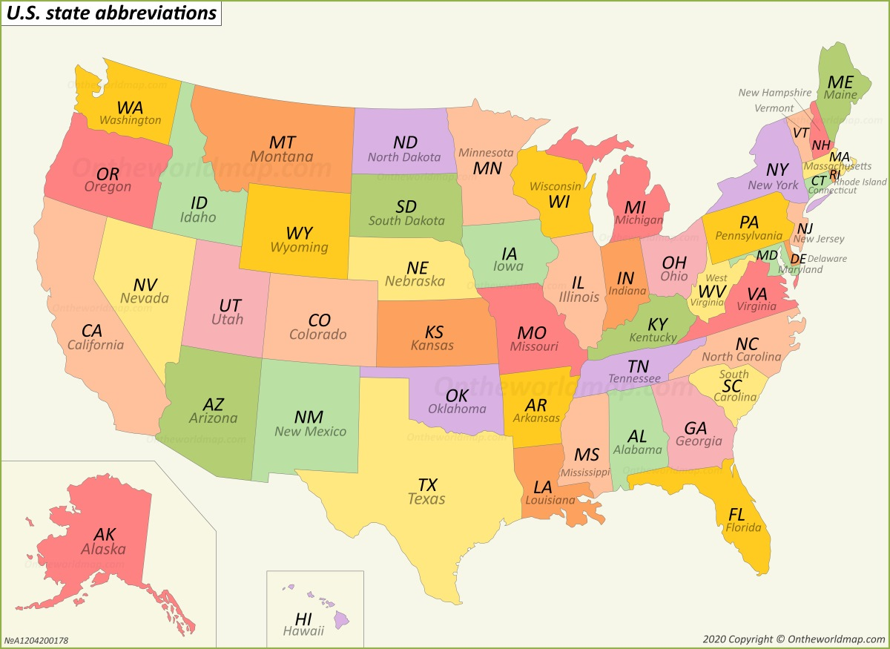

```{r setup, include=FALSE}
library(tidyverse)
library(ggplot2)
library(data.table)
library(maps)
library(plotly)
library(viridis)
library(gganimate)
library(patchwork)
```

```{r, include=FALSE}
#Import and clean data 
brfss = read_csv("data/BRFSS__Table_of_Tobacco_Use.csv") %>% 
  janitor::clean_names() %>% 
  filter(year == "2016"|year ==  "2017"|year ==  "2018"|year ==  "2019"|year ==  "2020") %>% 
  select(year, locationabbr, locationdesc, break_out, break_out_category,topic, question, geo_location, sample_size, data_value, response, question ) %>% 
  drop_na()
```

```{r,include=FALSE}
#A plot showing the geographic locations of smokers

clean_brfss = brfss %>% 
  select(-break_out, -break_out_category, -data_value) %>% 
  #later: smoker status may be useful too....
  filter(topic == "Current Smoker Status") %>% 
  filter(year != 2016) %>%
  select(-topic, -question) %>% 
  mutate(response = as.factor(response), 
         response = recode(response, "Yes" = "smoker", "No" = "non-smoker"))%>% 
  group_by(year, locationdesc) %>%
  mutate(pop_sum=sum(sample_size))  %>%
  ungroup() %>% 
  group_by(year, locationdesc, response) %>%
  mutate(smoking_statue_sum =sum(sample_size)) %>%
  select(-sample_size) %>% 
  distinct() %>% 
  pivot_wider(
    names_from = response,
    values_from = smoking_statue_sum) %>% 
  mutate(smoking_proportion = smoker/pop_sum) %>% 
  #I have to make the long, lat and remove the backets!
  mutate(geo_location = str_replace_all(geo_location, "\\*|\\(|\\)", "")) %>% 
  #create long and lat 
  separate(geo_location, c('lat', 'long'), sep = ",")%>% 
  mutate (long = as.numeric(long), 
          lat = as.numeric(lat))
  
#I learnt aggregate function in this homework ! #aggregate(.~fruit,data=df,FUN=sum)
#or you can use group_by(id1, id2) %>%  summarise_each(funs(mean) if you want to sum of rows based on column value in R dataframe
  
  #e.g  group_by(year, locationdesc) %>% summarise(Frequency = sum(sample_size))
# tm_facets(by = "year", nrow = 2, free.coords = FALSE)
```


```{r, include=FALSE}
US = map_data("state") 
# Create breaks for the color scale
mybreaks <- c(0.02, 0.04, 0.08, 1, 7)


map20 = clean_brfss %>% 
  ungroup() %>% 
  filter(year == "2020")  %>% 
  select(locationabbr, lat, long, smoking_proportion ) %>% 
  ggplot() +
    geom_polygon(data = US, aes(x=long, y = lat, group = group),  color="lightblue", fill="lightblue", alpha=0.3) +
    geom_point(aes(x=long, y=lat, size=smoking_proportion, color=smoking_proportion, alpha=smoking_proportion), shape=20, stroke=FALSE) +
  scale_size_continuous(range=c(1,7)) +
  ylim(27,48)+ xlim(-125,-78)  +
  theme_void()+ coord_map() +
  scale_color_viridis(trans="log") +
  labs(title = "2020",
       caption = "Data from BRFSS")
  
map19 = clean_brfss %>% 
  ungroup() %>% 
  filter(year == "2019")  %>% 
  select( locationabbr, lat, long,smoking_proportion )%>% 
  ggplot() +
    geom_polygon(data = US, aes(x=long, y = lat, group = group),  color="lightblue",fill="lightblue", alpha=0.3) +
    geom_point(  aes(x=long, y=lat, size=smoking_proportion, color=smoking_proportion, alpha=smoking_proportion), shape=20, stroke=FALSE) +
  scale_size_continuous(range=c(1,7)) +
  ylim(27,48)+ xlim(-125,-78)  +
    theme_void()+ coord_map() +
  scale_color_viridis(trans="log") +
  labs(title = "2019")+ theme(legend.position='none')


map18 = clean_brfss %>% 
  ungroup() %>% 
  filter(year == "2018")  %>% 
  select( locationabbr, lat, long,smoking_proportion )%>% 
  ggplot() +
    geom_polygon(data = US, aes(x=long, y = lat, group = group),  color="lightblue",fill="lightblue", alpha=0.3) +
    geom_point(  aes(x=long, y=lat, size=smoking_proportion, color=smoking_proportion, alpha=smoking_proportion), shape=20, stroke=FALSE) +
  scale_size_continuous(range=c(1,7)) +
  ylim(27,48)+ xlim(-125,-78)  +
    theme_void()+ coord_map() +
  scale_color_viridis(trans="log") +
  labs(title = "2018")+ theme(legend.position='none')


map17 = clean_brfss %>% 
  ungroup() %>% 
  filter(year == "2017")  %>% 
  select( locationabbr, lat, long,smoking_proportion )%>% 
  ggplot() +
    geom_polygon(data = US, aes(x=long, y = lat, group = group),  color="lightblue",fill="lightblue", alpha=0.3) +
    geom_point(  aes(x=long, y=lat, size=smoking_proportion, color=smoking_proportion, alpha=smoking_proportion), shape=20, stroke=FALSE) +
  scale_size_continuous(range=c(1,7)) +
  ylim(27,48)+ xlim(-125,-78)  +
    theme_void()+ coord_map() +
  scale_color_viridis(trans="log") +
  labs(title = "2017")+ theme(legend.position='none')
```

## The Distribution of Smoking Proportion By States

```{r, echo=FALSE, warning=FALSE}
#patchwork
(map17|map18)/
  (map19|map20)
```

The more yellowish and bigger the dot, the higher the smoker's proportion. Conversely, the bluer and smaller the dot, the lower th smoker's proportion of the state. 

## Which states has the highest and lowest smoking proportion? 


### The three highest smoking proportion

```{r, warning = FALSE, message = FALSE}
three_highest =
  clean_brfss %>%
  ungroup() %>%
  select(year, locationdesc, smoking_proportion) %>%
  mutate(year = as.factor(year)) %>%
  mutate(smoking_proportion = round(smoking_proportion, digits = 3)) %>%
  group_by(year) %>%
  top_n(3) %>%
  arrange(year, desc(smoking_proportion)) %>%
  mutate(string = str_c(locationdesc, ", ", smoking_proportion)) %>%
  select(-locationdesc, -smoking_proportion) %>%
  pivot_wider(
    names_from = year,
    values_from = string
  ) %>% unnest()

knitr::kable(three_highest)
```

**West Virginia**, **Kentucky**, and **Tennessee** are the most seen in this table. West Virginia had 2nd, 1st, 2nd, 1st proportion of smoking in 2017 (22.1%), 2018 (21.2%), 2019 (20.1%), and 2020 (20.2%), respectively. Tennessee had the 3rd, 2nd, 3rd proportion of smoking in 2017 (21.2%), 2018 (20.5%), 2019 (19.3%), respectively. It shows a slightly decreasing trend with time, which is a good sign. Kentucky had the 3rd, 1st, and 3rd proportion of smoking in 2018 (19.9%), 2019 (20.6%), and 2020 (19.4%), respectively. In addition, **Guam** only had the highest smoking proportion in 2017 (22.6%), and not appeared in top 3 later. The state government might have paid attention to the smoking problem. However, **Ohio** became the 2nd highest smoking proportion in 2020 (19.6%).


### The three lowest smoking proportion

```{r, warning = FALSE, message = FALSE}
three_lowest =
  clean_brfss %>%
  ungroup() %>%
  select(year, locationdesc, smoking_proportion) %>%
  mutate(year = as.factor(year)) %>%
  mutate(smoking_proportion = round(smoking_proportion, digits = 3)) %>%
  group_by(year) %>%
  top_n(-3) %>%
  arrange(year, smoking_proportion) %>%
  mutate(string = str_c(locationdesc, ", ", smoking_proportion)) %>%
  select(-locationdesc, -smoking_proportion) %>%
  pivot_wider(
    names_from = year,
    values_from = string
  ) %>% unnest()

knitr::kable(three_lowest)
```

Among all the states, **Utah** has the lowest smoking proportion in the four years, which were 8.2% (2017), 8.2% (2018), 7.1% (2019), 7.0% (2020).  **Puerto Rico** has the 2nd lowest smoking proportion in 2017 (9.3%), 2018 (9%), and 2019 (8.5%), and the 3nd in 2020. **California** also did well in 2019 (10.1%) and 2020 (8.5%). They even shows a slightly decreasing trend with years. However, **Connecticut** and **Washington** only appeared once in 2017 (10.6%) and 2018 (10.4%) respectively.


## The states with the largest change in proportion of smoking

```{r, message = FALSE}
change_df = 
  clean_brfss %>% 
  ungroup() %>%
  arrange(smoking_proportion) %>%
  select(year, locationabbr, lat, long, smoking_proportion) %>% 
  pivot_wider(
    names_from = year, 
    values_from = smoking_proportion
  ) %>% 
  drop_na() %>% 
  rename( new = "2020", 
          old = "2017",
          state = locationabbr) %>% 
  mutate(change = new - old) %>% 
  arrange(change) %>%
  mutate(state = fct_reorder(state, change)) %>%
  select(state, lat, long, change) %>%
  mutate(change = round(change, digits = 4))

change_df %>%
  mutate(
    text_label = str_c("State: ", state, "\nDecrease in Proportion: ", change)
  ) %>%
  plot_ly(
    x = ~state, y = ~change, color = ~state, type = "bar", text = ~text_label,  colors = "viridis"
  ) %>%
  layout(title = "The Decrease in Smoking Proportion Comparing 2020 to 2017",
         xaxis = list(title = "State"),
         yaxis = list(title = "Decrease in Proportion"))
```

**Guam** has the highest decrease in the proportion of smoking comparing 2020 to 2017 with a value of 6.15%. **District of Columbia** has the second large decrease of smoking proportion with a value of 5.16%. On the contrary, **Texas** has the highest increase in the proportion of smoking with a value of 2.61%.**Ohio** has the second highest increase in the proportion of smoking with a value of 2.07%


