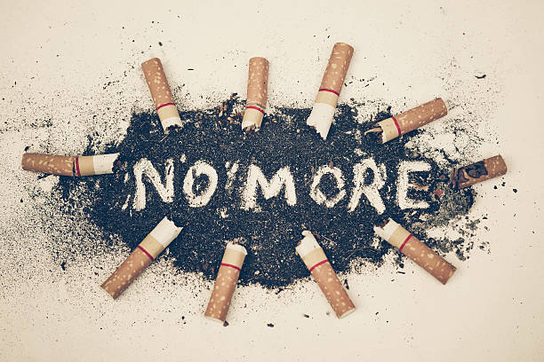

# Here are some suggestion for you to quite smoking!
YOU CAN:

1. Talk to a quit smoking counselor individually or in a group.

2. Get [free confidential coaching](https://www.cdc.gov/tobacco/campaign/tips/quit-smoking/quitline/index.html)through a telephone quitline (1-800-QUIT-NOW).

3. Use a mobile app like [quitSTART](https://www.cdc.gov/tobacco/campaign/tips/quit-smoking/quitstart-app/index.html).
More suggestion can be found in [Centers for Disease Control and Prevention (CDC)](https://www.cdc.gov/tobacco/quit_smoking/how_to_quit/index.htm)

## Quit Smoking!
